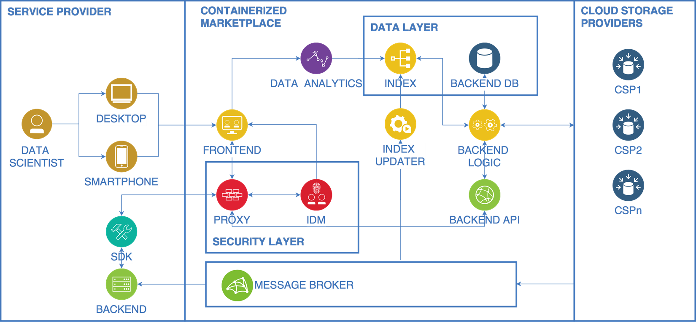

# Marketplace-API

This repository contains information related to the AutoMat Marketplace API. AutoMat Marketplace allows creating cross-sectorial services using vehicle information represented in the CVIM model. The Marketplace API exposes endpoints that will be consumed by Service Providers in order to:
- Retrieve statistical information about available data-packages
- Create and manage offers
- Retrieve statistical information about data-packages whose owners have subscribe an offer.
- Explore accessible data-packages
- Retrieve accessbile data-packages.

The following figure illustrates the role of the API as the entrypoint for Service Providers.

.

In order to simplify using the Marketplace API, an [SDK](https://github.com/automat-project/SDK/) has been also provided.

Specifically, this repository provides the following contents:
- [OpenAPI API description](https://github.com/automat-project/Marketplace-API/tree/master/postman): [OpenAPI](https://www.openapis.org/) description of AutoMat Marketplace RESTful API. A live version of this document is accessible in the [Marketplace](https://automat-marketplace.atosresearch.eu:1337/docs/).
- [Postman Example Collection](https://github.com/automat-project/Marketplace-API/tree/master/postman)
- Some utilities:
  - [OAuth2 Token](https://github.com/automat-project/Marketplace-API/tree/master/utils/oauth2_token): Simple Node.JS script to retrieve an OAuth2 token from AutoMat IDM.
